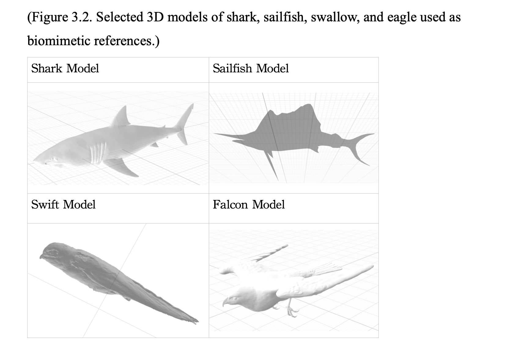
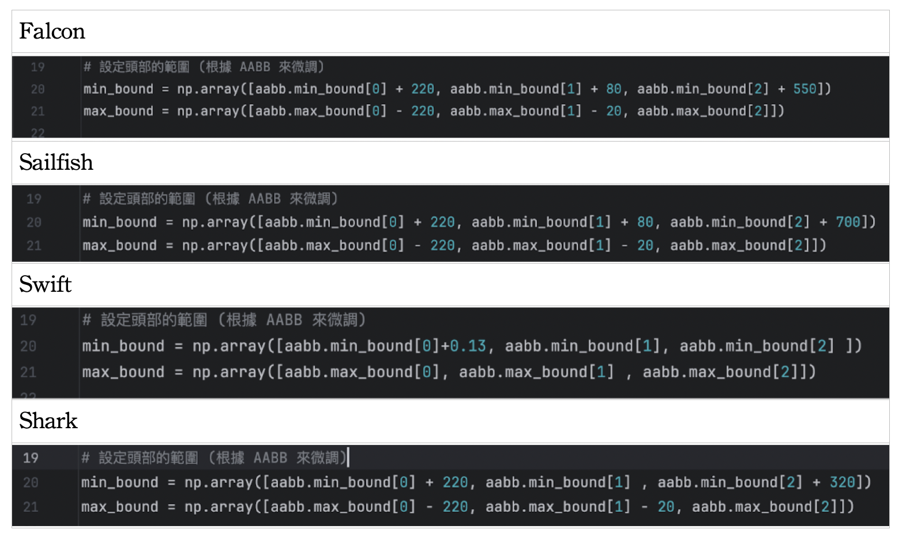
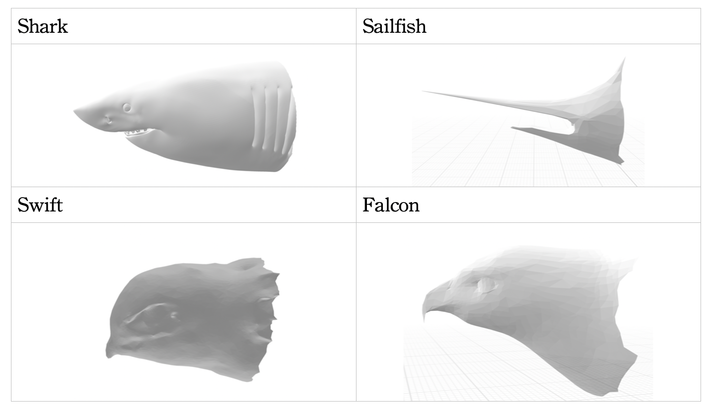
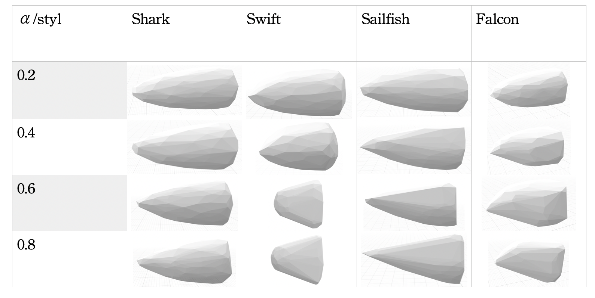
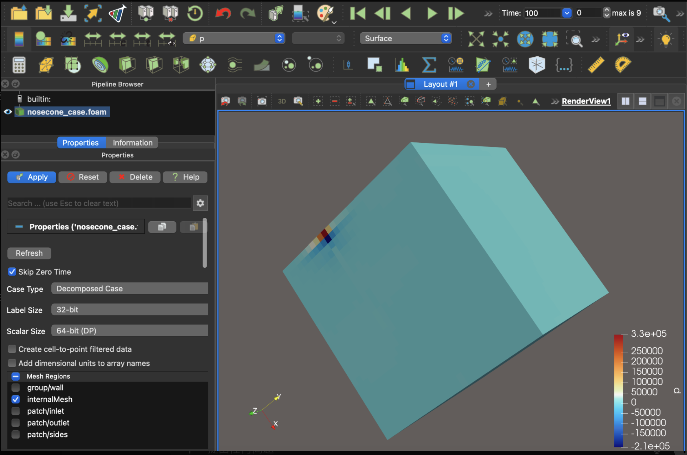
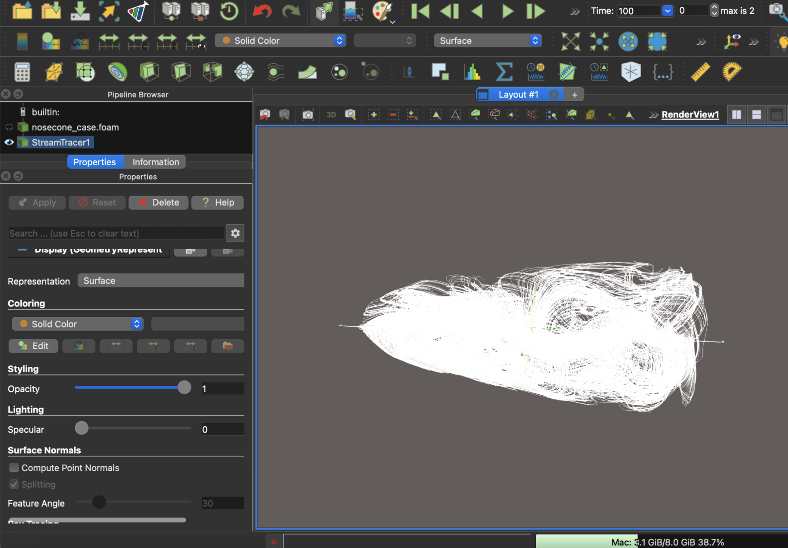

#  Biomimetic Nose Cone Design for Aerodynamic Optimization

**Author:** Bonny Chen  
**Project Type:** Ongoing Research  
**Software:** OpenFOAM, Autodesk Inventor Python (Open3D, Trimesh), Excel, Docker, PycharmCE  
**Keywords:** Biomimicry, Rocket Design, Aerodynamics, Curvature Blending, CFD Simulation  

This project was conducted independently during high school as an exploratory engineering study.

---

<details>
<summary> Table of Contents</summary>

- [Current Direction](#current-direction)
  - [1. Abstract](#1-abstract)
  - [2. Introduction](#2-introduction)
  - [3. Literature Review](#3-literature-review)
  - [4. Research Methodology](#4-research-methodology)
    - [4.1 Design and Modeling](#41-design-and-modeling)
    - [4.2 Simulation and Fabrication](#42-simulation-and-fabrication)
    - [4.3 Physical Testing](#43-physical-testing)
  - [5. Key Limitation and Redefinition](#5-key-limitation-and-redefinition)
  - [6. Revised Research Direction](#6-revised-research-direction)
  - [7. Future Work](#7-future-work)
  - [Excel Nose Cone Blending](#excel-nose-cone-blending)
  - [Early CFD Issues (OpenFOAM)](#early-cfd-issues-openfoam)
- [Future Development Plan](#future-development-plan)
  - [Project Overview](#project-overview)
  - [Project Objective](#project-objective)
  - [1. Establishing Baseline Nose Cone Geometries](#1-establishing-baseline-nose-cone-geometries)
  - [2. Parameterization of Bio-Inspired Geometry](#2-parameterization-of-bio-inspired-geometry)
  - [3. Expanding Evaluation Metrics Beyond Drag Coefficient](#3-expanding-evaluation-metrics-beyond-drag-coefficient)
  - [4. Introduction of Stability Considerations Through Unsteady CFD](#4-introduction-of-stability-considerations-through-unsteady-cfd)
  - [5. Stability-Aware Performance Optimization](#5-stability-aware-performance-optimization)
  - [6. Expected Outcomes and Research Impact](#6-expected-outcomes-and-research-impact)
  - [7. Long-Term Research Extensions](#7-long-term-research-extensions)
  - [Quick Summary](#quick-summary)

- [Repository Structure](#repository-structure)
</details>

---

## Current Direction


## 1. Abstract
This ongoing study integrates **biomimetics**, **curve fitting**, and **fluid dynamics** to explore naturally occurring shapes that exhibit low drag and high stability, applying these findings to rocket nose cone design. Inspired by high-speed biological forms such as sharks, swallows, sailfish, and eagles, I developed a computational and experimental workflow combining **Open3D** modeling, **Python scripting**, **CFD simulation (OpenFOAM)**, and **wind tunnel testing**. 

Initial simulations and physical tests suggested that while biomimetic shapes can offer smoother flow attachment, full replication of biological asymmetry introduces aerodynamic imbalance in rockets. This led to a refined approach—**partial curvature blending**—where local geometric segments inspired by nature are smoothly integrated while preserving axial symmetry.

---

## 2. Introduction
### 2.1 Research Motivation
As the structural design lead in my high school’s **Taiwan Rocket Cup** team, I became fascinated by how different nose cone profiles—conical, ogive, ellipsoidal, parabolic—affect performance. Beyond these traditional geometries, I began questioning whether nature’s own streamlined designs could inspire more efficient solutions.

### 2.2 Research Objectives
The primary objective is to determine whether integrating biological curvature patterns can:
1. Reduce drag coefficient (Cd) by improving flow attachment.
2. Minimize flow separation and pressure gradients.
3. Enhance stability by smoothening the pitching moment variation during flight.

---

## 3. Literature Review
Traditional rocket nose cones are defined by analytical or parametric curves—ogive, conical, and Haack series—optimized for drag under ideal flow conditions. However, they often fail to balance **stability** and **wake control** at transonic speeds.

Recent advances in **biomimetic engineering** highlight how natural organisms achieve aerodynamic efficiency through subtle curvature transitions and distributed surface textures. Shark heads, for example, minimize turbulence via micro-riblet patterns (Bechert et al., 2000), while birds’ beaks and head contours control lift and flow reattachment during dives (NASA Research Center, 2023).

Techniques such as **shape blending** and **morphing surfaces** enable controlled interpolation between geometries (Wang et al., 2016), providing a framework to integrate biological curvature into aerodynamic models.

Despite wide use in vehicle and aircraft design, **biomimetic blending for rockets** remains underexplored. This research aims to bridge that gap.

---

## 4. Research Methodology
### 4.1 Design and Modeling
**(1) Selection of Biological Models**  
Four species were selected for their high-speed, low-drag morphologies: shark, sailfish, swallow, and eagle. 3D models were obtained from open databases (Sketchfab), oriented using **Open3D**, and cropped to isolate the head sections.
<p align="center">
  
</p>

**(2) Model Preprocessing**  
- Automatic orientation alignment via principal axes computation.
- Laplacian smoothing to remove noise and preserve curvature continuity.
- Head extraction defined within adjustable AABB boundaries.
<p align="center">
  
</p>

<p align="center">
  <em>Cutting parameter</em>
</p>

<p align="center">
  
</p>

<p align="center">
  <em>Result contour</em>
</p>

**(3) Shape Blending**  
The standard ogive model and biological head models were converted into point clouds. Weighted interpolation generated blended geometries:
$$r(x) = (1 - \alpha(x))r_{eng}(x) + \alpha(x)r_{bio}(x)$$

Where the transition factor $\alpha(x)$ is governed by a modulated **smoothstep** function to ensure $C^1$ continuity:

$$\alpha(x) = \alpha_{max} \cdot \text{smoothstep}(0.2L, 0.8L; x)$$

* $r_{eng}(x)$: Radius profile of the standard aerodynamic geometry (e.g., Haack Series).
* $r_{bio}(x)$: Radius profile derived from biological inspiration.
* $L$: Total length of the nose cone.

The peak transition factor $\alpha_{max}$ was tested at discrete intervals:
$$\alpha_{max} = 0.2, 0.4, 0.6, 0.8$$
<p align="center">
  
</p>

<p align="center">
  <em>Blend result form</em>
</p>

### 4.2 Simulation and Fabrication
- **Software:** OpenFOAM v12 (simulation) and ParaView v5.13 (visualization).  
- **Conditions:** Mach 0.8–1.2, steady-state incompressible flow, no-slip wall boundary.  
- **Process:** Mesh generation (snappyHexMesh), steady-state pressure and velocity field computation, and drag coefficient estimation.

3D models were printed in **PLA**, mounted on PP tubes, and post-processed for surface smoothness. Pressure ports were drilled according to CFD pressure gradient results.

### 4.3 Physical Testing
A custom low-speed wind tunnel was constructed for flow visualization using smoke filaments. Pressure sensors (BMP388) measured surface pressure variations, validating CFD accuracy. Launch tests using commercial fireworks rockets were conducted to evaluate stability and altitude.
<p align="center">
  
</p>

<p align="center">
  <em>Simple wind tunnel design</em>
</p>

<p align="center">
  
</p>

<p align="center">
  <em>Wind tunnel operation diagram</em>
</p>

---

## 5. Key Limitation and Redefinition
CFD results revealed that **fully biomimetic geometries introduced lateral asymmetry**, creating side forces and unstable pitching moments. Rockets, unlike birds or fish, lack adaptive control surfaces to counteract such effects.

This realization redefined the research question:
> *How can biological curvature principles be integrated while maintaining aerodynamic symmetry?*

---

## 6. Revised Research Direction
### Functional Biomimicry through Local Curvature Blending

To maintain aerodynamic efficiency while integrating biological advantages, the model extracts the **front curvature segment** (approximately 20–30% of the total length) and blends it into the engineering base using a weighted interpolation:

$$r(x) = (1 - \alpha(x))r_{eng}(x) + \alpha(x)r_{bio}(x)$$

The transition factor $\alpha(x)$ is governed by a modulated **smoothstep** function to ensure $C^1$ geometric continuity:

$$\alpha(x) = \alpha_{max} \cdot \text{smoothstep}(0.2L, 0.8L; x)$$

This mathematical approach ensures:
* **Axisymmetric flow** and a stable pressure field across the hull.
* **$C^1$ smoothness**, preventing turbulence-inducing discontinuities.
* **Functional Biomimicry**, specifically optimized flow redirection and gradual pressure recovery.


### Quantitative Verification
Validation through computational analysis (see `bionosecone_blend_caculate.xlsx`) confirms high-fidelity adherence to the theoretical model:

| Metric | Value | Significance |
| :--- | :--- | :--- |
| **$RMSE_{\alpha}$** | $1.7 \times 10^{-11}$ | Near-perfect alignment with smoothstep curve. |
| **$RMSE_{r}$** | $0.0044 \text{ m}$ | Minimal radial deviation from blending theory. |

We evaluated the performance impact by varying the peak transition factor:
$$\alpha_{max} \in \{0.2, 0.4, 0.6, 0.8\}$$

---
## 7. Future Work
Future work will continue with a staged validation approach that balances numerical
analysis and physical testing. After finalizing the blended nose cone geometry using
the Excel-based parametric model, the design will be imported into Autodesk Inventor
for preliminary CFD analysis.

Inventor-based CFD will be used as a qualitative sanity check to evaluate overall
flow trends and identify obvious geometric issues before physical fabrication,
rather than as a source of final aerodynamic performance metrics.

Following numerical inspection, physical prototypes will be fabricated for
experimental validation. Low-speed wind tunnel testing with smoke-flow visualization
will be conducted to observe flow attachment, separation, and symmetry. Image-based
analysis of the flow patterns will then guide further geometric refinement before
subsequent real-world testing.

---
## Excel Nose Cone Blending

This project includes an Excel-based workflow for blending a **tangent ogive nose cone**
with a **bionic-inspired profile** to generate a smooth axial radius distribution.

The Excel workbook is used as a **geometry pre-processing step** before CAD modeling
in Autodesk Inventor and CFD simulation.

- Workbook file: `/excel/bionosecone_blend_caculate.xlsx`
- Quick overview (conceptual): `/excel/README_quickstart.md`
- Technical documentation (math & parameters): `/excel/README_technical.md`

### Early CFD Issues (OpenFOAM)

<p align="center">
  
</p>

<p align="center">
  <em>Incorrect threshold causing rectangular geometry</em>
</p>


<p align="center">
  
</p>

<p align="center">
  <em>Surface irregularities causing non-physical flow artifacts</em>
</p>

# Future Development Plan

### *(Stability-Aware Optimization of Bio-Inspired Rocket Nose Cones)*

## Project Overview

This project aims to develop a **research-grade aerodynamic optimization framework** for bio-inspired rocket nose cones that minimizes drag **while maintaining flow stability** across realistic flight Reynolds number ranges.

Rather than treating CFD as a visualization tool for drag estimation, this project reframes nose cone design as a **stability-aware aerodynamic problem**, integrating unsteady flow behavior into performance evaluation and optimization.

---

## Project Objective

To design and evaluate bio-inspired rocket nose cones that achieve:

- Low aerodynamic drag within the operational velocity range  
- Robust flow behavior that avoids asymmetric or unstable wake dynamics at high Reynolds numbers  

---

## 1. Establishing Baseline Nose Cone Geometries  
### *(Reference Framework for Comparative Analysis)*

The project begins by defining conventional nose cone geometries as **baseline reference cases**, including:

- Simple cone  
- Ogive nose cone  
- von Kármán nose cone  

These geometries are **not selected for optimal performance**, but to serve as controlled reference standards.  
Without a baseline, improvements or regressions introduced by bio-inspired modifications cannot be objectively assessed.

This approach treats nose cone optimization as a **controlled comparative experiment**, where each geometric modification is evaluated relative to a known aerodynamic standard rather than in isolation.

---

## 2. Parameterization of Bio-Inspired Geometry  
### *(From Visual Imitation to Engineering Variables)*

Rather than directly replicating biological shapes, bio-inspired designs are transformed into **parameterized engineering models**.

Key geometric features extracted from biological references (e.g., bird or fish head profiles) include:

- Curvature distribution along the nose length  
- Tip bluntness radius  
- Axial pressure-gradient smoothness  

This parameterization enables systematic control over geometric features and allows each design variation to be evaluated quantitatively.  
Through this process, the nose cone evolves from an aesthetic imitation into a **tunable aerodynamic model** suitable for scientific analysis.

---

## 3. Expanding Evaluation Metrics Beyond Drag Coefficient  
### *(Early Detection of Flow Degradation)*

Traditional optimization focuses primarily on the drag coefficient (\(C_d\)).  
In this project, drag remains a key metric but is no longer the sole indicator of performance.

Additional flow-field diagnostics include:

- Symmetry of surface pressure distribution  
- Emergence of lateral velocity components in the wake  
- Sensitivity of separation points to changes in Reynolds number  

Rather than asking only:

> *“How low is the drag?”*

the analysis addresses a more critical question:

> *“As velocity increases, does this geometry approach a flow instability that could rapidly degrade performance?”*

This shift marks the transition from **competition-level CFD** to **research-grade aerodynamic analysis**.

---

## 4. Introduction of Stability Considerations Through Unsteady CFD  
### *(Initial Stability Screening)*

To assess flow robustness, **unsteady CFD simulations** are conducted across a range of Reynolds numbers while keeping the nose cone rigidly fixed.

The simulations monitor the spontaneous emergence of:

- Lateral velocity fluctuations  
- Asymmetric vortex structures  
- Low-frequency oscillations in aerodynamic forces  

The objective is not full aeroelastic modeling, but an **initial stability screening** to identify whether a given geometry exhibits sensitivity to perturbations.

This step evaluates whether a design is *stable*, not merely *fast*.

---

## 5. Stability-Aware Performance Optimization  
### *(Balancing Speed and Robustness)*

A key insight guiding this project is:

> **The geometry with the lowest drag is not necessarily the geometry that remains stable at high speeds.**

True high-speed performance requires a balance between:

- Low aerodynamic drag within the operational velocity range  
- Resistance to flow-induced asymmetry or instability  

Optimization is therefore conducted with **dual objectives**: minimizing drag while avoiding configurations that approach instability thresholds under realistic operating conditions.

---

## 6. Expected Outcomes and Research Impact

By integrating stability considerations into nose cone optimization, this project aims to:

- Identify bio-inspired geometric features that reduce drag **without compromising flow robustness**  
- Establish a reproducible framework for evaluating aerodynamic designs under increasing Reynolds numbers  
- Demonstrate how CFD can be used not only for performance prediction, but for **stability-informed engineering decision-making**

This methodology bridges intuitive bio-inspired design and rigorous aerodynamic analysis, enabling nose cone designs that achieve **reliable high-speed performance** rather than fragile peak efficiency.

---

## 7. Long-Term Research Extensions

Potential future extensions of this project include:

- Mapping stability boundaries across broader Reynolds number ranges  
- Applying reduced-order modeling techniques to characterize dominant wake modes  
- Coupling aerodynamic stability with structural flexibility for aeroelastic analysis  

---

## Quick Summary

> **This project reframes bio-inspired nose cone design from a drag-minimization problem into a stability-aware aerodynamic optimization problem.**


## Repository Structure
```
├── assets/                         # Figures and visualization assets
│   └── cfd_iteration/              # Early OpenFOAM failure / iteration screenshots
│       ├── threshold_error.png
│       ├── misalignment.png
│       ├── rough_surface_p.png
│       ├── rough_surface_streamtracer.png
│       ├── rough_surface_streamtracer2.png
│       └── README.md
├── 0/                              # OpenFOAM initial & boundary conditions
├── constant/                       # OpenFOAM physical properties and mesh
├── system/                         # OpenFOAM solver and numerical settings
├── excel/                          # Excel-based nose cone blending workflow
│   ├── bionosecone_blend_caculate.xlsx
│   ├── README_quickstart.md
│   └── README_technical.md
├── MakerPortfolio.pdf
├── allmodel.zip
└── nosecone_case.foam

```

---


[↑ Back to top](#1-abstract)
