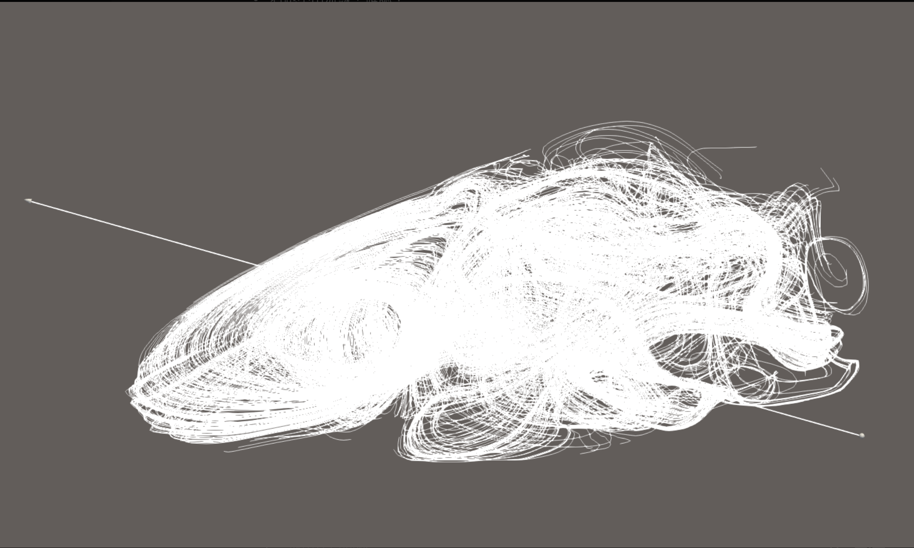
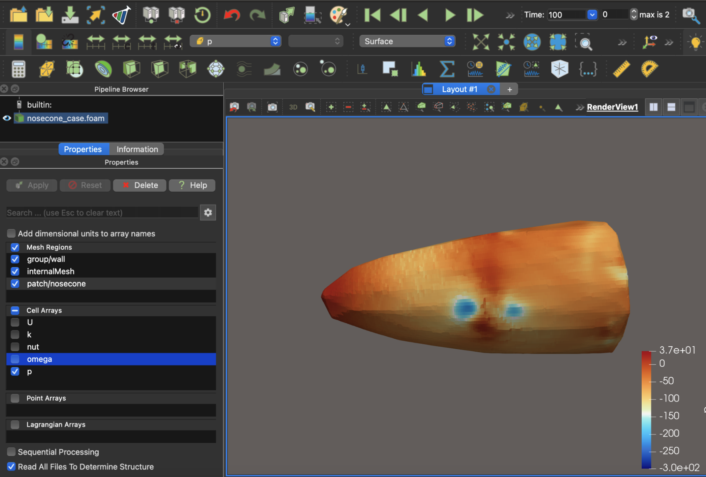
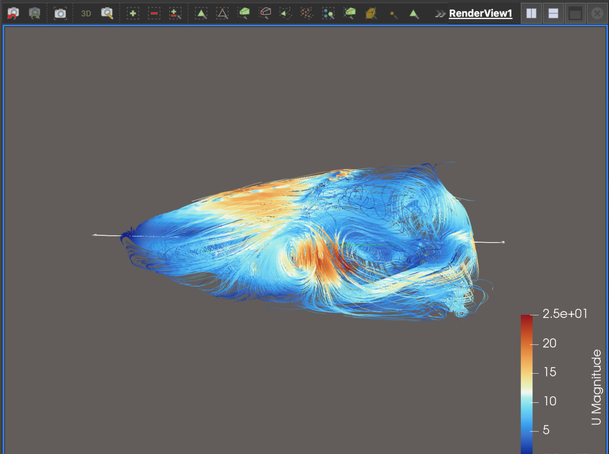

## Early OpenFOAM Attempts and Tooling Decision

Initial CFD attempts were conducted using OpenFOAM to visualize the flow field around the nose cone geometry.

During early stages, incorrect threshold and visualization settings resulted in the geometry appearing as a rectangular block rather than a nose cone. After correcting these settings, the nose cone shape became visible; however, further inspection revealed misalignment between the geometry and the reference flow axis.

Once the geometry was properly aligned, additional issues became apparent: the surface quality of the imported geometry was insufficiently smooth, leading to non-physical flow artifacts and unstable streamlines. These artifacts were caused by surface irregularities rather than meaningful aerodynamic behavior.

Although it was possible to manually smooth or adjust the geometry to improve CFD visual quality, doing so would compromise the geometric fidelity of the original design. Since preserving shape accuracy was a priority, artificially modifying the surface purely for numerical convenience was deemed inappropriate.

As a result, I chose to pause OpenFOAM-based simulation and restructure the workflow. Geometry generation and smoothing were instead handled analytically using an Excel-based parametric model and refined in Autodesk Inventor, ensuring both geometric continuity and design fidelity before any further CFD analysis.
## Threshold configuration error

Incorrect threshold settings caused the geometry to appear as a rectangular block,
preventing meaningful flow interpretation.

---

## Geometry–axis misalignment

The nose cone geometry was not aligned with the reference flow axis,
leading to misleading streamline visualization.

---

## Surface quality issue

Surface irregularities introduced non-physical vortices and unstable streamlines.
